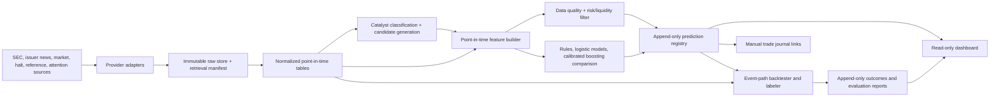

# Architecture

Status: proposed architecture, 16 July 2026. No implementation or performance claim exists yet.

## Objective and output semantics

The system ranks potential Nasdaq and NYSE movers for human review. For a stated strategy profile, prediction time, reference-price convention, and outcome horizon, it estimates:

- probability of touching +5%, +10%, and +20%;
- probability of touching -5% and -10%;
- probability that each configured target is reached before its paired stop;
- expected maximum favourable excursion (MFE) and maximum adverse excursion (MAE);
- probability of momentum continuation versus reversal;
- model confidence and a separate data-quality score.

Touch probabilities are not mutually exclusive. For example, a path may touch both +5% and -5% during its horizon. A prediction never represents an exact future-price forecast.

Every strategy profile versions four important definitions: candidate trigger, reference price and entry delay, outcome horizon, and continuation/reversal rule. The initial profiles will be:

| Profile | Intended use | Candidate horizon | Initial outcome windows |
| --- | --- | --- | --- |
| `low_float_intraday` | Catalyst-driven day watchlist | Premarket through first trading hour | 15 minutes, 60 minutes, session close |
| `event_momentum` | Event-driven continuation | Event through first session | 60 minutes, session close, next close |
| `spec_news_swing` | Speculative news swing | Event day | 1, 3, and 5 trading sessions |

The windows are configuration proposals, not settled empirical choices. They must be frozen before final out-of-sample evaluation.

## Logical data flow



There is deliberately no order, broker, or execution-routing component.

## Planned repository layout

```text
config/                  versioned source, strategy, label, risk, model configs
data/                    ignored local raw/intermediate/curated data
docs/                    architecture, contracts, sources, reports
predictions/             ignored append-only shadow outputs and manifests
reports/                 generated backtest and calibration reports
src/equity_research/
  cli/                   explicit ingest, train, backtest, predict commands
  ingestion/             SEC, news, market, halt, reference, attention adapters
  schemas/               validated normalized and prediction contracts
  catalysts/             deterministic taxonomy then statistical classifier
  features/              point-in-time feature definitions and materialization
  models/                rules, logistic, calibration, boosting comparison
  backtest/              candidate replay, path labels, fills, costs, halts
  risk/                  liquidity filters and reason codes
  shadow/                scheduled read-only scoring and append-only writes
  dashboard/             Streamlit views and manual journal UI
tests/                   deterministic unit, contract, and end-to-end fixtures
```

## Storage and time model

The local-first stack uses immutable compressed source objects, Parquet normalized tables, and DuckDB views/catalogues. SQLite may be used only for transactional manual journal edits. Large licensed data remains outside Git.

Each record distinguishes:

- `event_at`: when the market or corporate event occurred;
- `published_at`: source-declared publication time, when available;
- `first_seen_at`: earliest time this system observed the item;
- `ingested_at`: when this retrieval was persisted;
- `available_at`: conservative time from which the record may enter features.

Feature eligibility requires `available_at <= prediction_as_of`. If only a date is known, the adapter applies a documented conservative availability rule rather than assuming midnight. Timestamps are stored in UTC with an exchange-session key derived in `America/New_York`.

Raw response manifests contain source, request identity with secrets removed, retrieval time, content hash, byte count, licensing class, and adapter version. Corrections create new versions; they do not mutate history.

## Identity and universe

The internal `security_id` is stable across ticker changes. A slowly changing mapping records ticker, exchange, security type, effective interval, CIK when available, and provenance. Candidate universes exclude test issues, funds, warrants, rights, and other non-common instruments by explicit configurable rules, not by ticker pattern alone.

A current symbol directory is not a historical universe. Broad historical evaluation cannot be called survivorship-bias safe until the selected provider supplies delisted/inactive securities and effective-dated reference data, or the project has accumulated its own daily snapshots over time. The first real sample report must state its narrower coverage.

## Ingestion modules

### Market data

Provider adapters normalize daily/minute bars first, then trades and NBBO quotes if entitled. Required metadata includes feed (`IEX`, delayed SIP, SIP, or vendor-specific equivalent), adjustment status, trade/quote conditions, and source latency. Consolidated quote coverage is preferred for low-float liquidity and fill modelling.

### SEC and company news

SEC ingestion starts with submissions, daily indexes/RSS, filing documents, and selected XBRL facts. Company-news ingestion initially supports allowlisted issuer investor-relations RSS/Atom feeds and provider metadata. Full article bodies are stored only when terms explicitly permit it; otherwise the system stores headline, timestamp, URL, identifiers, hashes, and extracted features.

### Catalyst classification

The first classifier is deterministic and auditable: form/item codes, filing exhibits, headline phrases, source type, and structured facts map to a versioned taxonomy. Initial classes include financing/dilution, clinical/regulatory, earnings/guidance, contract/customer, M&A/strategic alternatives, legal/regulatory, management/governance, listing/compliance, split/corporate action, and other/uncertain. Multi-label output, evidence spans, and an `unknown` path are required. Statistical text classification is deferred until a labelled corpus exists.

### Retail attention

Attention adapters store aggregate counts and velocity, not unnecessary personal data. The first optional adapter is Reddit OAuth subject to the application and usage terms. No scraping of sites or circumvention of access controls is permitted. If no licensed source is configured, attention features remain missing rather than being synthesized.

## Features

Feature groups are versioned and carry an `available_at` contract:

- catalyst: type, source reliability, novelty, filing form/item, text evidence, dilution indicators;
- price/volume: gaps, returns, range, VWAP distance, relative volume, acceleration, volatility;
- liquidity: bid/ask spread, quote size, dollar volume, turnover proxy, price, halt/LULD state;
- issuer: shares outstanding and public-float disclosure age where actually available, market-cap proxy, listing status;
- context: sector/market returns, session phase, prior momentum, event clustering;
- attention: mention velocity, unique-author count where terms permit, source breadth, timestamped sentiment aggregates;
- quality: source latency, missingness, quote-feed breadth, stale identity/float flags, parsing confidence.

Data quality and predictive confidence are separate. A high model score on incomplete IEX-only or stale-float inputs must still show a low data-quality score.

## Models and calibration

1. **Rules baseline.** A transparent scorecard and historical outcome buckets establish whether the data and labels behave plausibly.
2. **Logistic baseline.** Separate regularized logistic models per target/horizon predict touch and target-before-stop labels. Another logistic model predicts continuation versus reversal. MFE and MAE begin with training-only empirical conditional means/quantiles and regularized regression.
3. **Gradient boosting comparison.** A boosting classifier/regressor is considered only after the logistic pipeline, splits, and calibration report pass. It receives identical point-in-time features and folds.
4. **Calibration.** Platt or isotonic calibration is fitted only on the chronological calibration slice. The method is selected using training-era walk-forward folds, never the final test slice.

Model confidence is a bounded diagnostic based on calibration-bin support, fold stability, model agreement, and out-of-distribution distance. It is not a second probability and cannot override failed risk/data-quality gates.

## Labels and realistic replay

Outcomes are calculated from the first eligible price at or after the configured reference delay. A long-direction path label records whether each barrier was touched, first-touch timestamps, MFE, MAE, and continuation/reversal within the fixed horizon.

- With trades and quotes, simulated entries use the next eligible ask and exits use the next eligible bid, filtered for documented conditions.
- With minute bars only, fills use a configured spread/slippage model identified as estimated. If target and stop are both touched in one bar and ordering cannot be known, the record is marked ambiguous or resolved pessimistically according to a versioned policy.
- No fill occurs while halted. Stops are not assumed to execute through a halt at their trigger price.
- Participation limits cap assumed fill size as a fraction of observed volume. A quote-size or depth-aware rule is used when those data exist.
- Reverse splits, symbol changes, and corporate actions are applied from effective-dated records. Raw and adjusted prices remain distinguishable.

The backtest reports both signal-path outcomes and executable-policy outcomes. This prevents a strong chart pattern from hiding an untradeable spread or halt path.

## Validation and evaluation

All evaluation is chronological. Each walk-forward fold contains train, calibration, embargo where required, and test intervals. Overlapping label horizons are purged across boundaries. Model selection uses earlier folds; the final holdout remains untouched.

Reports include:

- event and prediction counts by time, symbol, catalyst, strategy, and outcome;
- Brier score, log loss, expected calibration error, reliability plots, ROC-AUC and PR-AUC;
- target-before-stop precision/recall and decision-curve summaries at predeclared thresholds;
- MFE/MAE error and interval coverage;
- coverage, abstention, quality flags, missingness, and source latency;
- fill rate, spread/slippage, halt exposure, turnover, and capacity assumptions;
- net simulated return only as a secondary, cost-adjusted result with uncertainty;
- clustered confidence intervals by event/security and explicit universe limitations.

## Live shadow operation

A shadow cycle reads sources, validates freshness, creates candidates, materializes point-in-time features, scores them, applies risk/liquidity flags, and atomically appends a versioned JSONL/Parquet prediction plus a manifest. It never imports or calls an order API. Later, a separate label job appends an outcome record.

The dashboard displays candidates, probabilities, calibration context, evidence links, quality/risk reasons, source health, and the manual journal. It does not contain a trade button. The journal can record a human's simulated decision and fills but never generates them.

## Principal risks

- **Data breadth:** IEX-only live data can miss material Nasdaq/NYSE activity and distort relative volume/spreads.
- **Survivorship:** current symbol lists cannot support unbiased historical universe claims.
- **Float/dilution:** reliable current tradable float is not a simple SEC API field; annual public-float disclosures and shares outstanding may be stale.
- **News timing:** article timestamps can be revised or backfilled; first-seen time must be preserved.
- **Sparse extremes:** +20% and target-first events are rare and catalyst-dependent, so estimates may require abstention or wider uncertainty.
- **Regime shift:** low-float behaviour and attention channels can change quickly; the short competition window does not justify frequent outcome-driven retuning.
- **Execution fidelity:** minute bars cannot reconstruct quote queues, same-bar path ordering, or halt gaps.

